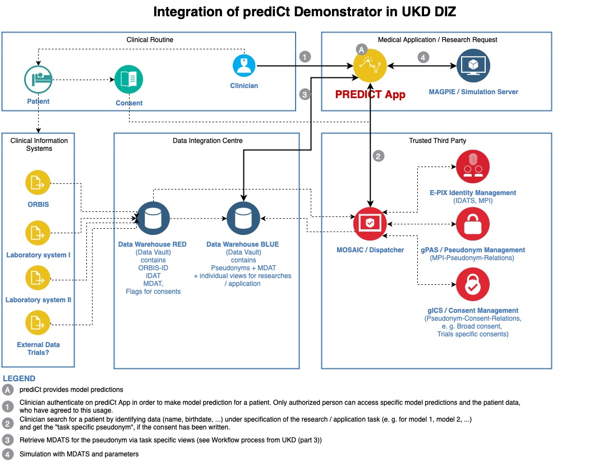

==================
Introduction
==================

Background
==========

PrediCt Demonstrator is a software framework mainly designed to be used for clinicians to execute and visualize mathematical model predictions for treatment decision making at an individual patient level. This framework can be seen as a further development of the `HaematoOPT Demonstrator <https://hopt.imb.medizin.tu-dresden.de/>`_. It extends this framework with the integration of a pseudonymisation service and access management. Furthermore, it can be used independendly of a clinical information system, because it is intended to be used within a data integration center (DIZ).

Possible Integration into a DIZ
===============================

Using the example of the data integration center of the University Hospitel Dresden, which is currently being established, the following figure describes a possible integration.

   Possible Integration of the PrediCt App into the DIZ

